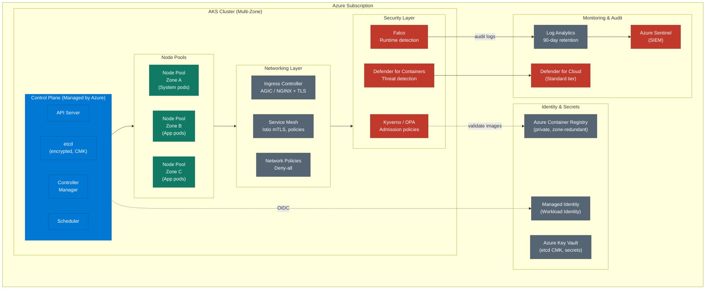

# AKS Kubernetes Platform — Security Architecture

## Security Controls Detail

### Control Plane Hardening
| Control | Implementation | Reference |
|---------|---------------|-----------|
| etcd encryption | Azure Key Vault CMK (RSA-HSM 4096) | CIS AKS 1.x |
| API server access | Private cluster + authorized IP ranges | CIS AKS 1.x |
| RBAC | AAD-integrated, Azure RBAC | CIS AKS 1.x |
| Local accounts | Disabled (`local_account_disabled = true`) | CIS AKS 1.x |
| OIDC issuer | Enabled (for Workload Identity) | Microsoft Best Practice |

### Node Pool Security
| Control | Implementation |
|---------|---------------|
| OS | Ephemeral OS disks (no persistent attack surface) |
| Auto-patching | Maintenance window: Sunday 01:00-04:00 UTC |
| Image Cleaner | Every 48h (remove unused images) |
| Node taints | `workload=application:NoSchedule` on app pools |
| Auto-scaling | Min 2 / Max 10 per zone, least-waste expander |

### Admission Policies (Kyverno)
| Policy | Mode | What It Enforces |
|--------|------|-----------------|
| disallow-privileged | Enforce | No privileged, hostPID, hostIPC, hostNetwork |
| require-image-digest | Enforce | SHA digest required in production (no `:latest`) |
| restrict-registries | Enforce | Only `myacr.azurecr.io` and `mcr.microsoft.com` |
| require-resource-limits | Enforce | CPU + memory requests/limits on all containers |
| require-non-root | Enforce | runAsNonRoot, drop ALL caps, readOnlyRootFilesystem |

### Network Policies
| Policy | Namespaces | Effect |
|--------|-----------|--------|
| default-deny-all | production, staging | Block all ingress + egress |
| allow-from-istio-ingress | production | Allow gateway → app:8080 |
| allow-prometheus-scrape | production | Allow monitoring ns → app:8080/metrics |
| allow-egress-dns | production, staging | Allow egress port 53 |
| allow-egress-monitoring | production | Allow egress to Loki (3100), OTel (4317/4318) |

### Istio Service Mesh
| Resource | Config | Effect |
|----------|--------|--------|
| PeerAuthentication | STRICT (production) | Mandatory mTLS for all pod-to-pod traffic |
| PeerAuthentication | PERMISSIVE (staging) | mTLS enabled but not required |
| AuthorizationPolicy | deny-all (default) | Block all traffic not explicitly allowed |
| AuthorizationPolicy | allow-ingress-to-app | SPIFFE principal-based ingress allow |
| DestinationRule | ISTIO_MUTUAL | Enforce mTLS for outbound connections |

### TLS Certificate Management
| Issuer | Use Case | Renewal |
|--------|---------|---------|
| letsencrypt-production | External HTTPS (app.example.com) | Auto (DNS-01 via Azure DNS) |
| letsencrypt-staging | Testing/non-prod | Auto |
| internal-ca | Internal service mTLS | Auto (cert-manager) |
