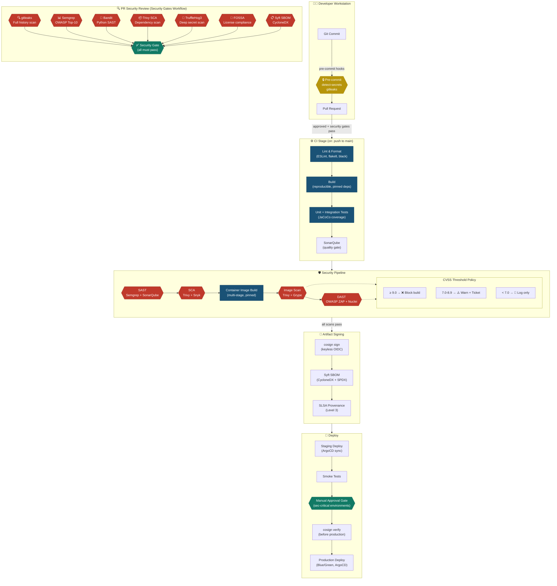

# Secure CI/CD Pipeline — Architecture

## CVSS Threshold Policy

| Severity | CVSS Score | Action |
|----------|-----------|--------|
| Critical | ≥ 9.0 | **Block build immediately** — PR cannot merge |
| High | 7.0 – 8.9 | **Warn + auto-create GitHub Issue** — must fix within 7 days |
| Medium | 4.0 – 6.9 | **Log only** — track in vulnerability backlog |
| Low | < 4.0 | **Informational** — review at next sprint |

## Key Tool Mapping

| Pipeline Stage | Primary Tool | Secondary Tool | Output |
|---------------|-------------|----------------|--------|
| Secret detection | gitleaks | detect-secrets, TruffleHog3 | SARIF → GitHub Security |
| SAST | Semgrep (OWASP) | Bandit (Python), SonarQube | SARIF + Quality Gate |
| SCA | Trivy (filesystem) | Snyk | SARIF → GitHub Security |
| Image scan | Trivy (image) | Grype | SARIF → GitHub Security |
| DAST | OWASP ZAP | Nuclei | HTML report + SARIF |
| SBOM | Syft (CycloneDX) | Syft (SPDX) | Attached to release |
| Signing | cosign (keyless) | SLSA provenance | Attestation in ACR |
