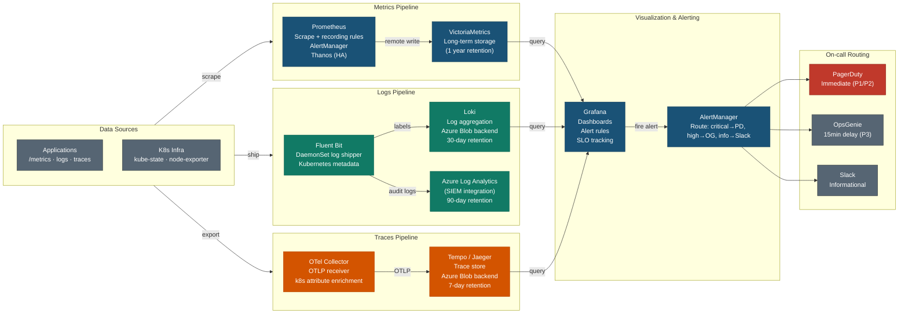

# Observability Stack — Architecture

## Component Reference

### Metrics — Prometheus Stack
| Component | Role | Config |
|-----------|------|--------|
| Prometheus | Scrape + rules + alerts | `prometheus-config.yaml` |
| Thanos Sidecar | Block upload + HA | Sidecar per Prometheus replica |
| VictoriaMetrics | Long-term storage (1yr) | Remote write target |
| AlertManager | Alert routing | `alertmanager-config.yaml` |
| kube-state-metrics | K8s object metrics | Deployment, pods, PVC |
| node-exporter | Node-level metrics | CPU, RAM, disk, network |

### Logs — Loki Stack
| Component | Role | Config |
|-----------|------|--------|
| Fluent Bit | Log collection + shipping | `fluent-bit-config.yaml` (DaemonSet) |
| Loki | Log aggregation + query | `loki-config.yaml` |
| Azure Log Analytics | SIEM / compliance | Diagnostic settings |

**Fluent Bit filters applied:**
1. Kubernetes metadata enrichment (namespace, pod, container labels)
2. Add cluster name + environment labels
3. Drop health check noise (`/healthz`, `/readyz`, `/livez`)
4. JSON log parsing

### Traces — OpenTelemetry Stack
| Component | Role | Config |
|-----------|------|--------|
| OTel Collector | Receive + process + export | `otel-config.yaml` |
| Tempo | Trace storage + query | `tempo-config.yaml` |
| Receivers | OTLP gRPC/HTTP, Jaeger, Zipkin | Ports: 4317, 4318, 14268, 6831 |
| Processors | Batch, k8sattributes, resource detection | Enrich all spans |
| Metrics Generator | Span → metrics (RED method) | Remote write to Prometheus |

### Grafana Dashboards
| Dashboard | UID | Data Sources | Key Panels |
|-----------|-----|-------------|-----------|
| Security Overview | `devsecops-security-overview` | Prometheus + Loki | Falco alerts, CVE counts, auth failures, cert expiry |
| SLO Dashboard | `devsecops-slo` | Prometheus | Availability, error rate, p50/90/99, burn rate, error budget |

### Alert Routing Policy
| Severity | Channel | Delay | Example |
|----------|---------|-------|---------|
| CRITICAL | PagerDuty | Immediate (30s) | Falco CRITICAL alert, service down |
| WARNING | OpsGenie | 15 min grouping | High CVE detected, cert expiring in 14d |
| INFO | Slack | 5 min grouping | Deployment success, scale events |

### SLO Targets
| Service | Availability | Latency (p99) | Error Rate |
|---------|-------------|---------------|-----------|
| API endpoints | 99.9% (43.8 min/month) | < 500ms | < 0.1% |
| Background jobs | 99.5% | < 5s | < 0.5% |

### Data Retention
| Store | Retention | Backend |
|-------|-----------|---------|
| Prometheus | 15 days (local) | Local disk |
| VictoriaMetrics | 1 year | Azure Blob |
| Loki | 30 days | Azure Blob |
| Tempo | 7 days | Azure Blob |
| Log Analytics | 90 days | Azure managed |
