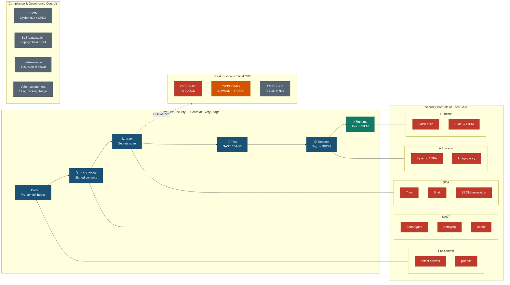

# DevSecOps Security Gates — Shift-Left Architecture

## Security Gate Details

### Stage 1: Code (Pre-commit)
| Check | Tool | Fail Action |
|-------|------|------------|
| Hardcoded secrets | detect-secrets | Block commit |
| Git history secrets | gitleaks | Block commit |
| Private keys | detect-secrets (regex) | Block commit |
| Azure credential patterns | gitleaks (custom rules) | Block commit |

### Stage 2: PR / Review (Security Gates Workflow)
| Check | Tool | Threshold |
|-------|------|-----------|
| SAST — multi-language | Semgrep (OWASP Top-10, CWE-25) | ERROR level → block |
| SAST — Python | Bandit (HIGH/HIGH) | Block |
| SCA — dependencies | Trivy filesystem | CRITICAL → block |
| Deep secret scan | TruffleHog3 (verified only) | Any → block |
| License compliance | FOSSA | Policy violation → block |
| SBOM generation | Syft (CycloneDX + SPDX) | Always generate |

### Stage 3: Build (Secrets Scan)
| Check | Tool | Action |
|-------|------|--------|
| Dockerfile lint | Hadolint | WARNING → fail |
| IaC scan | Trivy config, terraform tflint | CRITICAL → fail |
| Dependency SBOM | Syft | Attach to artifact |

### Stage 4: Test (SAST / DAST)
| Check | Tool | Action |
|-------|------|--------|
| Code quality gate | SonarQube | Quality gate fail → block |
| DAST full scan | OWASP ZAP | High alert → warn |
| CVE scanning | Nuclei | Critical → block |
| Image scan | Trivy image + Grype | CRITICAL → block |

### Stage 5: Release (Sign + SBOM)
| Check | Tool | Action |
|-------|------|--------|
| Image signing | cosign (keyless OIDC) | Required |
| SBOM generation | Syft | CycloneDX + SPDX |
| SLSA provenance | slsa-github-generator | Level 3 |
| Pre-deploy verify | cosign verify | Block if unverified |

### Stage 6: Runtime (Falco + SIEM)
| Rule | Severity | MITRE |
|------|----------|-------|
| Shell in container | CRITICAL | T1059 |
| Sensitive file write | CRITICAL | T1098 |
| Unexpected outbound | WARNING | T1071 |
| Setuid execution | CRITICAL | T1548 |
| Container drift | CRITICAL | T1611 |
| Crypto mining | CRITICAL | T1496 |
| K8s API from pod | CRITICAL | T1613 |
