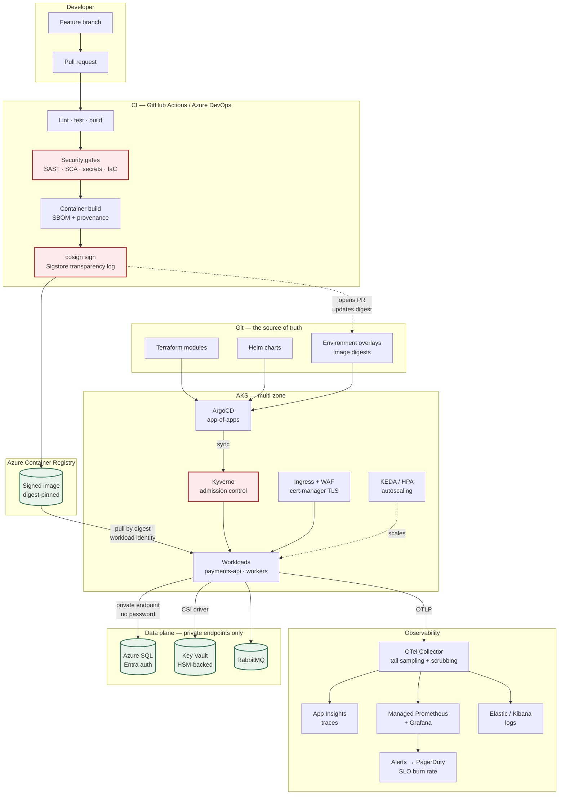
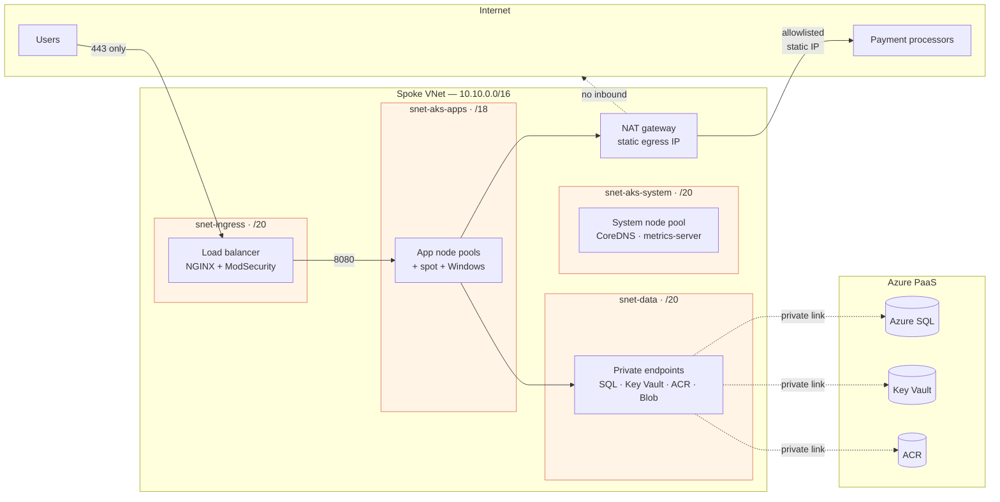
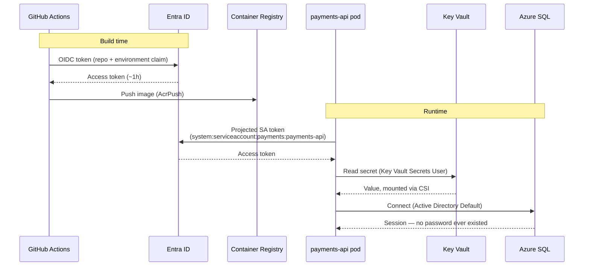
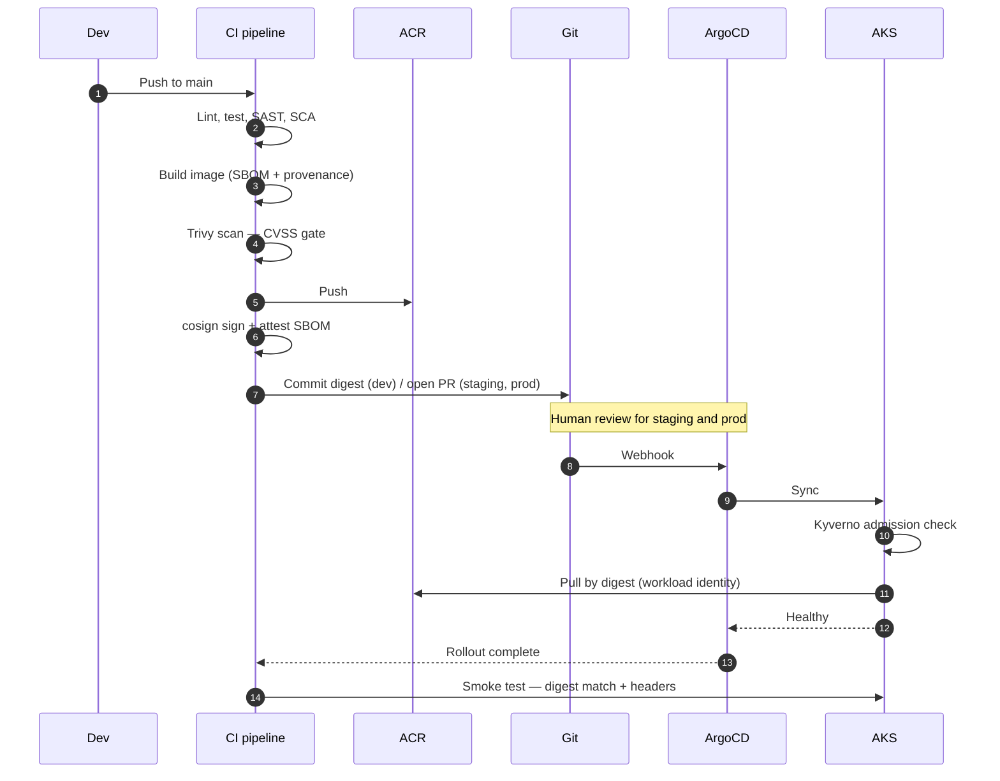
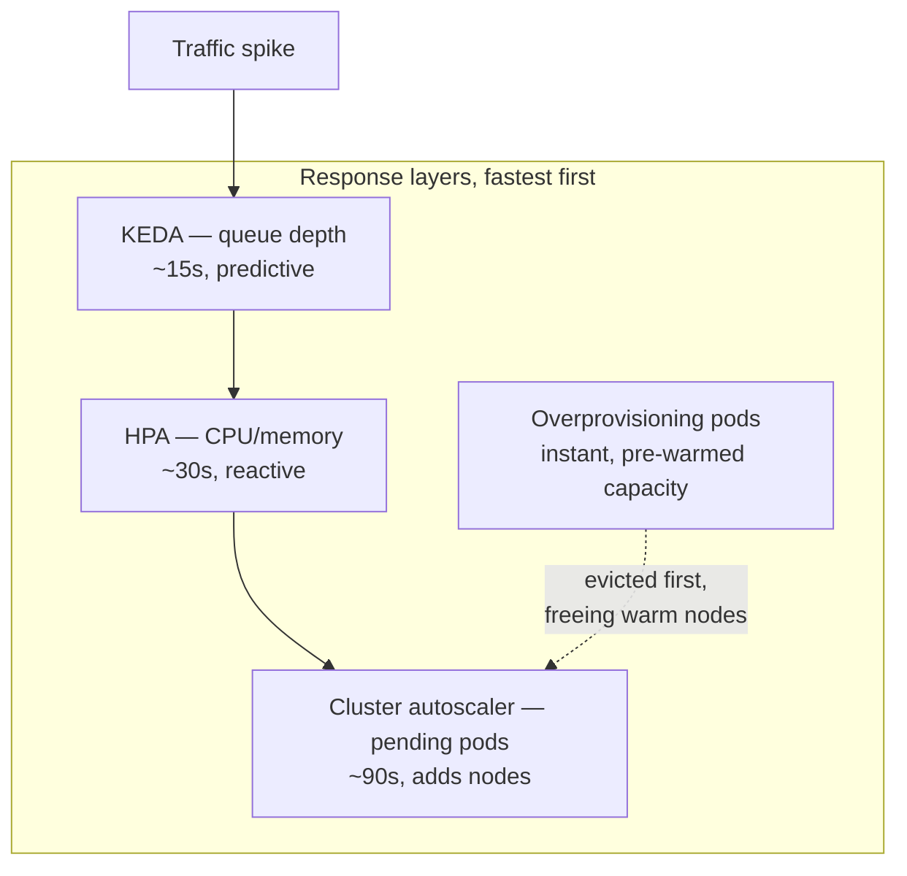
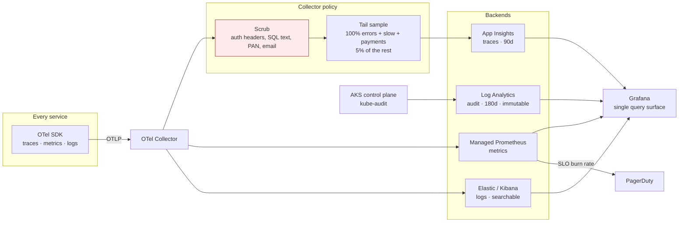
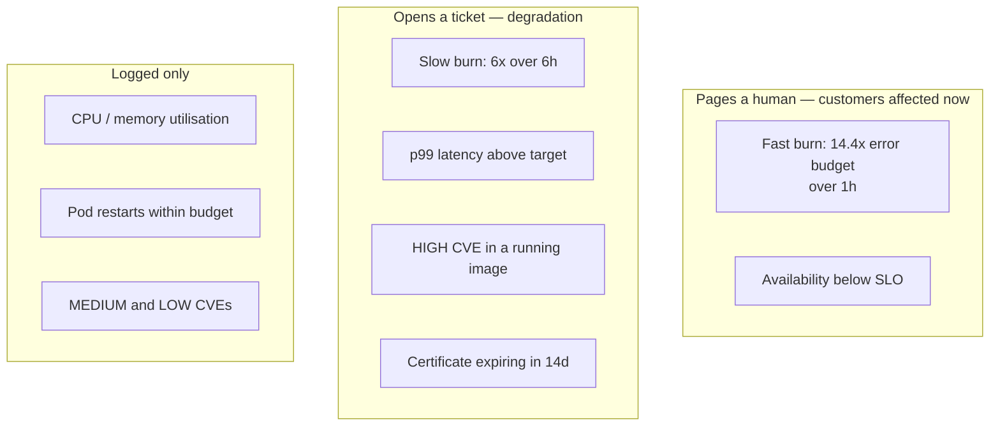

# Platform Architecture

How the pieces fit together, and where the boundaries are. Decisions and their
justifications live in [DECISIONS.md](./DECISIONS.md); this document describes
the resulting system.

---

## 1. The whole platform



**The one thing to notice:** CI never talks to the cluster. It builds a signed
image and proposes a digest change in git; ArgoCD does the deploying. A
compromised pipeline can propose a change, not make one.

---

## 2. Network segmentation



Every subnet has a deny-by-default NSG. The data subnet additionally denies all
outbound internet traffic — a private endpoint has no reason to originate a
connection, and that rule is what turns a compromised database credential from
an exfiltration path into a dead end.

The NAT gateway exists because payment processors allowlist source IPs. Default
AKS egress uses ephemeral load-balancer addresses that change on scale events,
which would break the integration exactly when traffic is highest.

---

## 3. Identity — no long-lived secrets anywhere



Three federation relationships replace three stored credentials. The federated
credential is pinned to one namespace and one service account name, so a
compromised pod in `staging` cannot assume the `prod` identity — the subject
claim will not match.

What remains in Key Vault is what genuinely must be stored: third-party API
keys and payment-processor credentials. Those are mounted by the CSI driver at
pod start and rotated on a 2-minute interval, never materialised as a
long-lived Kubernetes Secret.

---

## 4. Delivery flow



Rollback is `git revert`. There is no separate rollback procedure to remember
or test, because the forward and backward paths are the same mechanism.

---

## 5. Autoscaling under seasonal load

Rebtel's traffic is spiky around key calling seasons. Four layers respond at
different timescales:



The ordering matters. CPU is a *lagging* indicator for an IO-bound API: by the
time CPU rises, requests are already queuing. KEDA scaling on RabbitMQ queue
depth reacts before the pods are saturated, and the cluster autoscaler is tuned
to scale up fast (`scale_down_delay_after_add = 15m`) so a spike does not cause
node thrash.

| Knob | Value | Why |
|---|---|---|
| `scaleUp.stabilizationWindowSeconds` | 0 | React immediately; a spike is not noise |
| `scaleUp` policy | +100% or +4 pods / 30s | Double capacity per interval |
| `scaleDown.stabilizationWindowSeconds` | 300 | Avoid a sawtooth after the peak |
| `scaleDown` policy | −25% / 60s | Give back capacity gradually |
| App pool `min_count` (prod) | 5 | Floor absorbs the spike before autoscaling |
| `maxUnavailable` on rollout | 0 | Never lose capacity mid-deploy |
| PDB `minAvailable` | 66% | A node drain cannot take the service down |

---

## 6. Observability signal routing



Head sampling at 10% would discard 90% of errors — precisely the traces anyone
wants during an incident. Tail sampling keeps every error, every request slower
than 1s, and every payment flow, then samples the boring successful traffic at
5%. Cost falls without the diagnostic value falling with it.

Scrubbing happens at the collector, not in each service. A service that logs
too much is then contained by platform configuration rather than by a code fix
in someone else's repository.

---

## 7. Alerting philosophy



CPU utilisation never pages. A service at 90% CPU that is serving every request
within its latency objective is a service that is correctly sized; waking
someone for it trains them to ignore alerts, which is how the real page gets
missed.

---

## 8. Repository layout

```
lab/
├── terraform/
│   ├── bootstrap/          Remote state + OIDC federation (run once)
│   ├── modules/
│   │   ├── network/            VNet, subnets, NSGs, NAT, private DNS
│   │   ├── aks/                Cluster, node pools, autoscaler, workload identity
│   │   ├── platform-identity/  ACR, Key Vault, federated credentials
│   │   ├── data/               Azure SQL, platform storage
│   │   └── observability/      Log Analytics, App Insights, Prometheus, alerts
│   └── envs/{dev,staging,prod}/  Composition roots
├── charts/dotnet-service/  The platform contract as a Helm chart
├── apps/payments-api/      Reference .NET 10 workload
├── kubernetes/
│   ├── apps/               ArgoCD projects, app-of-apps, environment overlays
│   └── platform/           Namespaces, OTel collector
├── azure-pipelines/        Azure DevOps equivalent of the GitHub workflows
├── scripts/                Security-contract assertions
├── docs/                   This file, DECISIONS.md, RUNBOOKS.md, MIGRATION-DOTNET.md
└── Makefile                Every CI check, runnable locally
```
