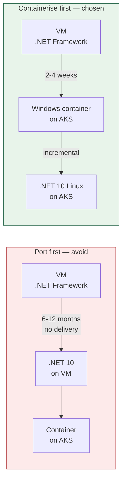
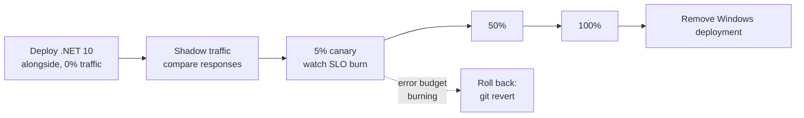

# Migrating legacy .NET Framework services from Azure VMs to AKS

The target is a containerised .NET 10 workload on Linux nodes, running under the
platform contract (`lab/charts/dotnet-service`). The route there matters as much
as the destination: a two-year port with no intermediate value is how
modernisation programmes get cancelled.

---

## The sequencing decision



Porting first leaves the service on unmanaged VMs for the entire effort — its
own deployment path, its own monitoring, its own patching, and no benefit until
the very end. Containerising first moves it onto the platform's scheduler,
observability, secret management and autoscaling in weeks. The port then becomes
an incremental change to a service that is already operationally modern, and it
can be paused if priorities shift without leaving anything half-finished.

This is why [ADR-013](./DECISIONS.md#adr-013) provisions a Windows node pool
that is explicitly expected to be deleted.

---

## Phase 0 — Assess (1 week per service)

Answer these before committing to a route:

| Question | Why it decides the route |
|---|---|
| Does it use `System.Web` / WebForms? | No .NET Core equivalent — needs a rewrite, not a port |
| WCF services hosted or consumed? | `CoreWCF` covers most cases; duplex contracts do not |
| Windows-only APIs (registry, WMI, COM, MSMQ)? | Each needs a Linux-native replacement |
| GAC assemblies or third-party COM? | Often the blocker that forces a long Windows stay |
| Windows Authentication? | Needs redesign to Entra ID + OAuth |
| File paths, `\` separators, drive letters? | Mechanical but pervasive |
| Local disk state? | Must move to Blob or a database before containerising |

Run the .NET Upgrade Assistant for an inventory rather than a verdict:

```bash
dotnet tool install -g upgrade-assistant
upgrade-assistant analyze ./LegacyService.sln
```

**Output of this phase:** each service classified as *lift* (containerise as
Windows, port later), *port* (straight to .NET 10 Linux), or *rewrite*
(WebForms and similar — schedule separately, do not block the programme on it).

---

## Phase 1 — Containerise on Windows (2–4 weeks)

```dockerfile
# Windows Server Core is required for full .NET Framework.
# It is ~5GB; this is a waypoint, not a destination.
FROM mcr.microsoft.com/dotnet/framework/aspnet:4.8.1-windowsservercore-ltsc2022

WORKDIR /inetpub/wwwroot
COPY ./publish/ .

# Configuration moves to environment variables now, before the port, so
# the .NET 10 version inherits a working pattern rather than web.config.
ENV ASPNET_ENVIRONMENT=Production

EXPOSE 80
```

Deploy with the standard chart, overriding for Windows:

```yaml
nodeSelector:
  kubernetes.io/os: windows
  workload-type: legacy-dotnet-framework

tolerations:
  - key: os
    operator: Equal
    value: windows
    effect: NoSchedule

# Windows containers cannot run as an arbitrary UID and have no read-only
# rootfs support. Kyverno needs a documented, scoped exception — one that
# names these workloads rather than disabling the policy.
podSecurityContext:
  windowsOptions:
    runAsUserName: "ContainerUser"

securityContext:
  readOnlyRootFilesystem: false
  runAsNonRoot: false

# Windows images are large and start slowly; the default startup probe
# budget will kill the pod before IIS is ready.
probes:
  startup:
    failureThreshold: 60
    periodSeconds: 10

resources:
  requests:
    cpu: 500m
    memory: 2Gi
  limits:
    memory: 2Gi
```

**What this phase already delivers**, before a single line is ported:

- Rolling deploys with surge-only rollout instead of in-place VM updates
- Horizontal autoscaling instead of a fixed VM count
- Secrets from Key Vault instead of `web.config`
- Centralised logs and metrics
- The same GitOps promotion flow as every other service

**Exit criteria.** Running on AKS, in the GitOps flow, with dashboards and
alerts, and the VM decommissioned.

---

## Phase 2 — Port to .NET 10 (4–12 weeks per service)

Work in this order. Each step ships independently.

**1. Retarget the project file.** `packages.config` → `PackageReference`,
then multi-target so the codebase builds both ways during the transition:

```xml
<TargetFrameworks>net48;net10.0</TargetFrameworks>
```

**2. Replace Windows-only dependencies.**

| Legacy | Replacement |
|---|---|
| `System.Configuration` | `Microsoft.Extensions.Configuration` |
| `System.Web.HttpContext` | `IHttpContextAccessor` |
| WCF service host | CoreWCF, or a minimal API if the contract allows |
| MSMQ | RabbitMQ (already on the platform) |
| Windows Authentication | Entra ID + JWT bearer |
| `System.Drawing` | `ImageSharp` or `SkiaSharp` |
| Registry / WMI | Configuration and platform metrics |
| Local disk | Azure Blob |

**3. Move configuration to environment variables.** Already done in Phase 1 —
this is where that pays back.

**4. Adopt the platform contract.** OTel instrumentation, `/healthz` and
`/readyz` split correctly (liveness must not depend on the database — restarting
a pod cannot fix a database outage, and the restart storm makes it worse),
graceful SIGTERM drain, security headers. `lab/apps/payments-api` is the
reference implementation.

**5. Switch to the Linux chiseled base image.** ~5GB → ~110MB, and the runtime
has no shell — so a Falco "shell in container" alert becomes unambiguous
evidence of compromise rather than someone debugging.

---

## Phase 3 — Cut over



Both versions run behind the same service. Traffic shifts by ingress weight, and
the rollback is a revert of the weight commit — the same mechanism as any other
change, so it is exercised rather than theoretical.

**Cut-over gate.** Do not proceed past 5% until, over at least one full business
cycle:

- error rate is within the SLO;
- p99 latency is at or below the Windows baseline;
- no unexplained difference in shadow-traffic response comparison;
- memory is stable (GC behaviour differs between Framework and .NET 10 — this
  is the most common late surprise).

---

## Tracking

The Windows node pool is the metric. Report monthly:

| Metric | Source |
|---|---|
| Workloads on the Windows pool | `kubectl get pods -l workload-type=legacy-dotnet-framework -A` |
| Windows node cost | Cost Management, filtered on the pool tag |
| Services fully on .NET 10 | Count of chart releases with the Linux base image |

When the first metric reaches zero, delete the pool
(`enable_windows_pool = false`) and close [ADR-013](./DECISIONS.md#adr-013).

---

## What usually goes wrong

**Windows images are enormous.** A 5GB pull on a cold node adds minutes to
scale-out. Pre-pull on the pool, and keep `min_count` above zero so a spike does
not wait for an image pull.

**`readOnlyRootFilesystem` cannot be set.** IIS writes to its own directories.
This is why the Kyverno exception must be scoped to these workloads by label
rather than relaxed cluster-wide — the exception should disappear with the pool.

**GC behaviour changes.** .NET 10 server GC is more aggressive about returning
memory. Services tuned for Framework's behaviour can show unfamiliar memory
profiles; watch working set for a full cycle before declaring the cut-over done.

**Time zones and culture.** `InvariantGlobalization=true` shrinks the image but
changes string comparison and date formatting. If the service formats currency
or parses user-supplied dates, either leave ICU in or fix the call sites — do not
discover this in production.

**Nobody owns the last 10%.** The final services are always the hardest, and the
programme quietly stalls with the Windows pool still running. Track it monthly
and name an owner.
