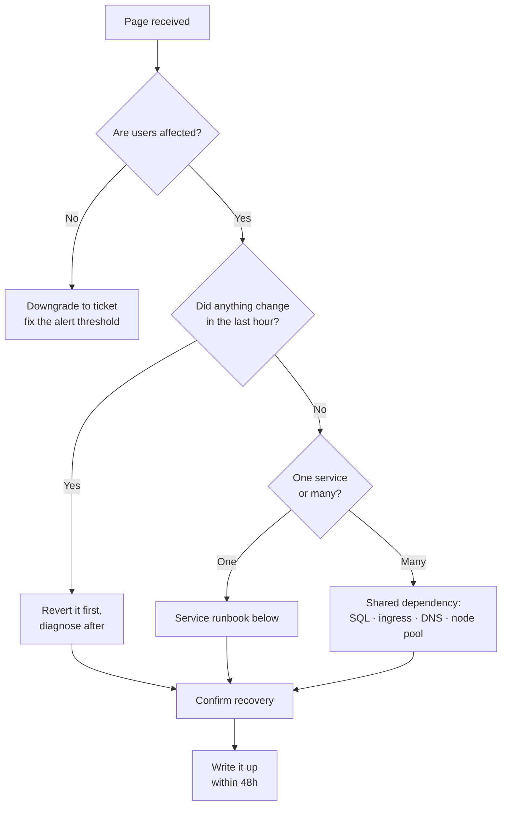

# Runbooks

Written for someone paged at 03:00 who did not build this. Each starts with the
alert that fires and ends with a verified resolution.

**Before anything else:** post in the incident channel that you are looking. A
second engineer duplicating your work is worse than a minute of latency.

---

## Triage order for any page



Reverting before diagnosing is deliberate. A revert is cheap and reversible; a
diagnosis under time pressure with users affected is neither.

---

## SLO fast burn — error budget burning 14.4x

**Alert:** `alert-slo-fast-burn-*` · **Severity:** page

At this rate the monthly budget is gone in about two days. Users are seeing
errors now.

**1. Confirm scope.**

```bash
kubectl get pods -n payments -o wide
kubectl top pods -n payments
```

Look for `CrashLoopBackOff`, pods not `Ready`, or all failures on one node.

**2. Check what changed.**

```bash
argocd app history payments-api-prod
kubectl rollout history deployment/payments-api-dotnet-service -n payments
```

**3. If a deploy correlates, revert it.**

```bash
# Preferred: git revert, so the cluster and git stay in agreement.
git revert <merge-commit> && git push
argocd app sync payments-api-prod

# Faster, if seconds matter. Note that ArgoCD self-heal will undo this —
# it buys time to prepare the revert, it is not the fix.
kubectl rollout undo deployment/payments-api-dotnet-service -n payments
```

**4. If nothing was deployed, check dependencies.**

```bash
# Readiness fails when SQL is unreachable; liveness deliberately does not.
kubectl get pods -n payments -o json \
  | jq -r '.items[] | "\(.metadata.name) ready=\(.status.conditions[]|select(.type=="Ready").status)"'

kubectl logs -n payments -l app.kubernetes.io/name=dotnet-service --tail=100 | grep -i "database\|timeout"
```

App Insights, last 15 minutes:

```kusto
requests
| where timestamp > ago(15m)
| summarize Total = count(), Failed = countif(success == false) by bin(timestamp, 1m), cloud_RoleInstance
| order by timestamp desc
```

If failures concentrate on one instance, delete that pod. If they are spread
evenly, the cause is downstream.

**5. Escalate** to the database on-call if SQL DTU or connection failures are
elevated, or to the network on-call if a private endpoint is unhealthy.

---

## Pods pending, not scheduling

**Alert:** `KubePodNotReady`, or noticed during a spike · **Severity:** ticket
unless capacity-related during peak

```bash
kubectl get events -n payments --sort-by='.lastTimestamp' | tail -20
kubectl describe pod <pod> -n payments | sed -n '/Events:/,$p'
```

| Message | Cause | Action |
|---|---|---|
| `Insufficient cpu/memory` | Pool at max | Raise `app_pool_max_count`; check the quota |
| `node(s) had untolerated taint` | Missing toleration | Check `nodeSelector`/`tolerations` in values |
| `exceeded quota` | Namespace ResourceQuota | Raise it deliberately, or find the leak |
| `FailedScheduling` on all nodes | Zone-spread constraint | Confirm `whenUnsatisfiable: ScheduleAnyway` |
| `ImagePullBackOff` | ACR auth or digest wrong | See below |

Confirm the autoscaler is actually trying:

```bash
kubectl -n kube-system logs -l app=cluster-autoscaler --tail=50 | grep -i "scale.up\|failed"
```

Capacity check during a peak:

```bash
kubectl get nodes -l workload-type=application --no-headers | wc -l
az aks nodepool show -g <rg> --cluster-name <aks> -n apps --query "{min:minCount,max:maxCount,current:count}"
```

If current equals max, raise the ceiling — this is the one change worth making
during an incident without a PR, followed by the PR.

---

## ImagePullBackOff

Almost always one of three things.

```bash
kubectl describe pod <pod> -n payments | grep -A5 "Failed"
```

**1. The digest does not exist.** A promotion PR merged with a typo, or the
image was pruned by the ACR retention policy.

```bash
az acr repository show -n <acr> --image payments-api@sha256:<digest>
```

**2. The kubelet identity lost AcrPull.** Rare, but it happens after a
Terraform change touching role assignments.

```bash
az role assignment list --assignee <kubelet-principal-id> --scope <acr-id> -o table
```

**3. The private endpoint is unhealthy** (production, where ACR has no public
access).

```bash
kubectl run -n payments dns-check --rm -it --restart=Never \
  --image=busybox:1.36 --command -- nslookup <acr>.azurecr.io
```

A public IP in the answer means private DNS resolution is broken — check the
zone link on the VNet.

---

## Certificate expiring or expired

**Alert:** `CertManagerCertExpirySoon` · **Severity:** ticket at 14 days, page
at expiry

```bash
kubectl get certificate -A
kubectl describe certificate <name> -n <ns>
kubectl logs -n cert-manager -l app=cert-manager --tail=100
```

Common causes: the ACME HTTP-01 challenge cannot reach the ingress (NSG rule or
DNS), or Let's Encrypt rate limits were hit by a loop of failed issuances.

```bash
# Force a renewal attempt
kubectl delete certificaterequest -n <ns> -l cert-manager.io/certificate-name=<name>
```

If expiry is imminent and ACME is failing, upload a manually obtained
certificate as a Secret and fix the automation afterwards — TLS down is
customer-visible, the automation is not.

---

## Database connection failures

**Symptom:** readiness probes failing, `SqlException` in logs.

Liveness deliberately does not check the database ([ADR-008 rationale in
DECISIONS.md](./DECISIONS.md)), so pods stay up and out of rotation rather than
entering a restart storm that makes the outage worse.

**1. Is SQL healthy?**

```bash
az sql db show-connection-string --client ado.net -s <server> -n <db>
az monitor metrics list --resource <sql-db-id> \
  --metric cpu_percent,connection_failed --interval PT1M
```

**2. Is it the identity rather than the database?**

```bash
kubectl logs -n payments -l app.kubernetes.io/name=dotnet-service --tail=50 \
  | grep -i "AADSTS\|token\|unauthorized"
```

`AADSTS700016` or `AADSTS70021` means the federated credential does not match —
usually the service account name or namespace changed without the Terraform
`workload_identities` map being updated. They must agree exactly.

**3. Is it connection exhaustion?** Business Critical allows 30k connections,
but the pool is per-pod. During a scale-out, pods × pool size can exceed it.

```kusto
AzureDiagnostics
| where Category == "SQLSecurityAuditEvents"
| where TimeGenerated > ago(15m)
| summarize count() by client_ip_s
```

---

## Suspected compromise

**Alert:** Falco CRITICAL, or a verified secret found by TruffleHog ·
**Severity:** page, and involve security immediately

**Contain first. Diagnose second. Preserve evidence throughout.**

**1. Isolate the pod without killing it** — a deleted pod destroys the evidence
and the replica is recreated anyway.

```bash
kubectl label pod <pod> -n payments quarantine=true --overwrite

kubectl apply -f - <<'EOF'
apiVersion: networking.k8s.io/v1
kind: NetworkPolicy
metadata:
  name: quarantine
  namespace: payments
spec:
  podSelector:
    matchLabels:
      quarantine: "true"
  policyTypes: [Ingress, Egress]
EOF
```

Empty ingress and egress rules mean deny everything. The pod keeps running,
detached from the network.

**2. Capture state.**

```bash
kubectl logs <pod> -n payments --previous > incident-$(date +%s).log
kubectl describe pod <pod> -n payments >> incident-$(date +%s).log
kubectl get events -n payments --sort-by='.lastTimestamp' >> incident-$(date +%s).log
```

**3. Revoke the identity** if credential misuse is suspected. This is the step
people hesitate over — do it. The service failing is preferable to continued
unauthorised access.

```bash
az identity federated-credential delete \
  --identity-name id-<platform>-prod-payments-api \
  -g <rg> -n fic-payments-api
```

**4. Check for lateral movement.**

```kusto
AzureDiagnostics
| where Category == "kube-audit-admin"
| where TimeGenerated > ago(24h)
| where log_s has "secrets" or log_s has "exec"
| project TimeGenerated, log_s
```

**5. Rotate everything that pod could read** — every Key Vault secret its
identity had access to, regardless of whether you can prove it was read.

---

## Terraform state is locked

```bash
# Confirm no apply is genuinely running before doing anything.
gh run list --workflow=lab-terraform.yml --limit 5
```

If a run was cancelled mid-apply the lease persists:

```bash
az storage blob lease break \
  --account-name <sa> --container-name tfstate-<env> \
  --blob-name <env>.terraform.tfstate --auth-mode login
```

Then reconcile before applying anything: a cancelled apply may have created
resources that state does not know about.

```bash
terraform plan   # look for resources it wants to create that already exist
terraform import <address> <resource-id>
```

Never `terraform force-unlock` without confirming the run is dead. Two
concurrent applies corrupt state, and recovery is manual.

---

## Rolling back a platform change

```bash
git revert <commit> && git push
# ArgoCD reconciles automatically; force it if you cannot wait.
argocd app sync platform-root --prune
```

For a Terraform change, revert and let the pipeline apply. Do not run
`terraform apply` locally against production — it bypasses the plan review and
the audit trail, which are the reasons the pipeline exists.

---

## After the incident

Within 48 hours, while it is still fresh:

- Timeline: detection → mitigation → resolution, with timestamps.
- What the customer experienced, in plain terms.
- Why the alert fired late or not at all, if that happened.
- Which runbook step was missing or wrong — and fix this document.
- Action items with owners and dates, tracked like any other work.

No blame. The interesting question is always why the system allowed the mistake,
not who made it.
